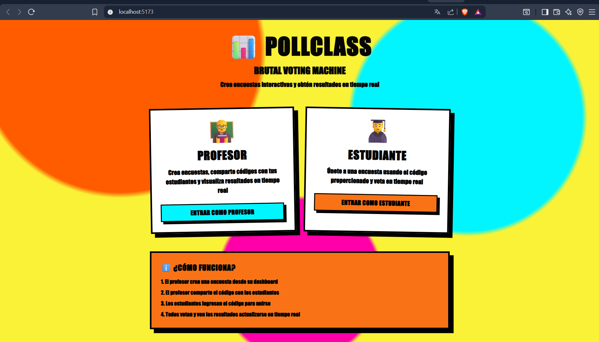
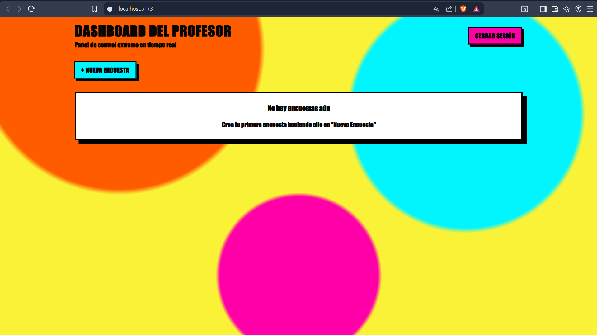
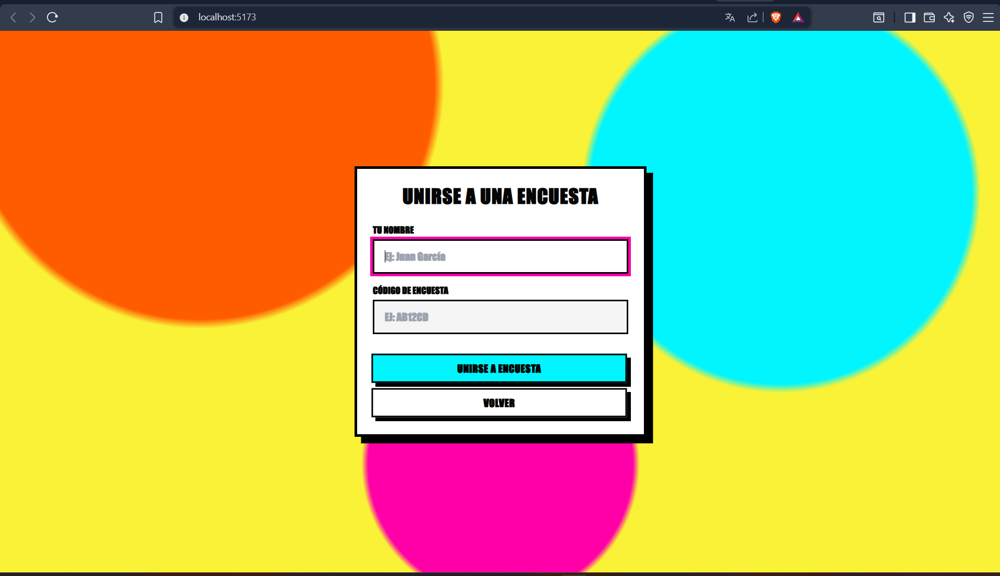
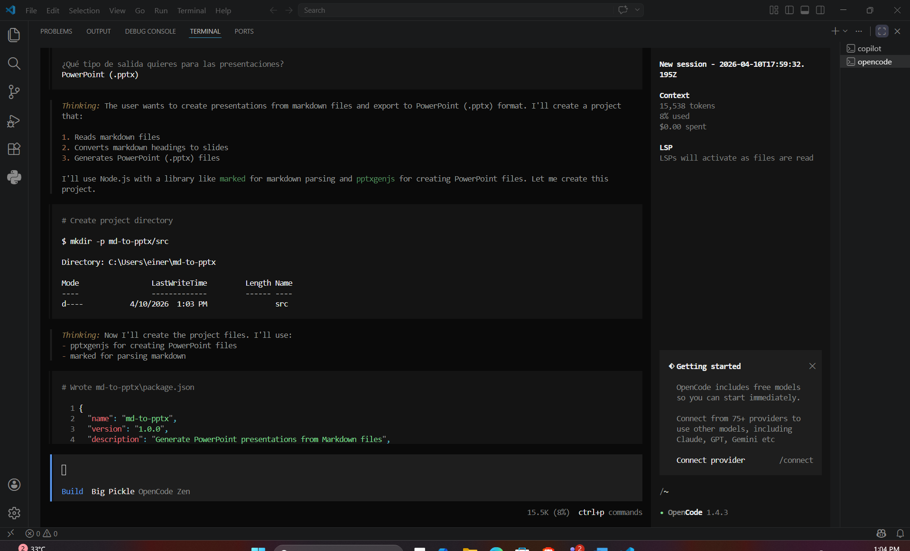

# PollClass

Plataforma de encuestas en tiempo real para clases.

## Capturas de Pantalla

### Landing


### Vista Profesor


### Vista Estudiante


### Proceso Agéntico con OpenCode


---

## Stack Tecnológico

### Backend
- **Runtime:** Node.js 18+ / Bun 1.0+
- **Framework:** Express.js 4.x
- **Base de datos:** MongoDB 4.4+ (con soporte para modo en memoria)
- **Autenticación:** JWT (JSON Web Tokens)
- **Manejo de CORS:** Configuración multi-origen

### Frontend
- **Framework:** React 18
- **Bundler:** Vite 5.x
- **Estilos:** Tailwind CSS 3.x
- **Gráficos:** Recharts
- **Gestión de estado:** Context API + Hooks
- **HTTP Client:** Fetch API

---

## Requisitos Previos

- Node.js 18+ o Bun 1.0+
- MongoDB 4.4+ (opcional, tiene modo en memoria)
- Git

---

## Instalación

### 1. Clonar el repositorio

```bash
git clone https://github.com/EiJassiel/PollClass-Desarrollo-Ag-ntico-Full-Stack-mosquera-einer.git
cd PollClass-Desarrollo-Ag-ntico-Full-Stack-mosquera-einer
```

### 2. Backend

```bash
cd back
bun install
```

#### Configuración de variables de entorno

Editar el archivo `.env` en la carpeta `back/`:

```env
MONGODB_URI=mongodb://localhost:27017/pollclass
USE_IN_MEMORY_MONGO=false
PORT=3000
NODE_ENV=development
JWT_SECRET=pollclass-super-secret
JWT_EXPIRES_IN=8h
TEACHER_USERNAME=profesor
TEACHER_PASSWORD=123456
```

> **Nota:** Si no tienes MongoDB instalado o Atlas te bloquea por IP, cambia `USE_IN_MEMORY_MONGO=true` para usar una base de datos temporal en memoria.

### 3. Frontend

```bash
cd ../front
bun install
```

---

## Ejecución

### Desarrollo

**Terminal 1 - Backend:**
```bash
cd back
bun run dev
```
El servidor estará disponible en: `http://localhost:3000`

**Terminal 2 - Frontend:**
```bash
cd front
bun run dev
```
La aplicación estará disponible en: `http://localhost:5173`

### Producción

**Backend:**
```bash
cd back
bun run build
bun start
```

**Frontend:**
```bash
cd front
bun run build
```
Los archivos compilados estarán en `front/dist/`

---

## Despliegue

### Opción A: Despliegue Manual en VPS

1. Instalar Node.js y MongoDB en el servidor
2. Clonar el repositorio
3. Seguir las instrucciones de instalación
4. Usar un gestor de procesos como PM2 para el backend:
```bash
npm install -g pm2
pm2 start back/src/server.js --name pollclass-api
pm2 startup
pm2 save
```

### Opción B: Docker (próximamente)

```dockerfile
# docker-compose.yml ejemplo
version: '3.8'
services:
  api:
    build: ./back
    ports:
      - "3000:3000"
  web:
    build: ./front
    ports:
      - "5173:80"
```

### Opción C: Servicios en la Nube

- **Backend:** Render, Railway, Heroku, Fly.io
- **Frontend:** Vercel, Netlify, GitHub Pages
- **Base de datos:** MongoDB Atlas (cloud)

---

## API Endpoints

### Autenticación
| Método | Ruta | Descripción |
|--------|------|-------------|
| POST | `/api/auth/login` | Login del profesor |

### Encuestas (Polls)
| Método | Ruta | Descripción |
|--------|------|-------------|
| POST | `/api/polls` | Crear encuesta* |
| GET | `/api/polls` | Listar todas* |
| GET | `/api/polls/:id` | Obtener por ID* |
| GET | `/api/polls/code/:code` | Obtener por código |
| GET | `/api/polls/:id/results` | Ver resultados |
| PUT | `/api/polls/:id/close` | Cerrar encuesta* |
| DELETE | `/api/polls/:id` | Eliminar encuesta* |

### Votos
| Método | Ruta | Descripción |
|--------|------|-------------|
| POST | `/api/votes` | Registrar voto |
| GET | `/api/votes/:pollId` | Ver votos de encuesta |
| GET | `/api/votes/:pollId/:studentId` | Verificar si votó |

*Requiere Bearer token (JWT)

---

## Credenciales

**Profesor:**
- Usuario: `profesor`
- Contraseña: `123456`

---

## Estructura del Proyecto

```
PollClass/
├── .github/              # Configuración GitHub
│   ├── copilot-instructions.md
│   └── skills/
├── back/                 # Backend (Express + MongoDB)
│   ├── src/
│   │   ├── models/       # Modelos de datos
│   │   ├── controllers/  # Lógica de negocio
│   │   ├── routes/       # Endpoints API
│   │   ├── middleware/   # Middleware
│   │   └── server.js     # Punto de entrada
│   ├── .env              # Variables de entorno
│   └── package.json
├── front/                # Frontend (React + Vite)
│   ├── src/
│   │   ├── components/   # Componentes reutilizables
│   │   ├── pages/        # Vistas principales
│   │   ├── context/      # Estado global
│   │   └── services/     # Llamadas API
│   ├── assets/           # Imágenes
│   └── package.json
└── README.md
```

---

## Características

- **Tiempo real:** Resultados actualizados cada 2 segundos mediante polling
- **Voto único:** Cada estudiante solo puede votar una vez por encuesta
- **Códigos de acceso:** Los profesores generan códigos únicos de 6 caracteres
- **Diseño responsive:** Funciona en desktop, tablet y móvil
- **Gráficos interactivos:** Visualización de resultados con barras y porcentajes
- **Seguridad:** Autenticación JWT para endpoints protegidos

---

## Flujo de Uso

1. El profesor inicia sesión con sus credenciales
2. Crea una nueva encuesta con título y opciones de respuesta
3. El sistema genera un código único de 6 caracteres
4. El profesor comparte el código con los estudiantes
5. Los estudiantes acceden a la landing page, ingresan su nombre y el código
6. Los estudiantes seleccionan una opción y envían su voto
7. Los resultados se actualizan en tiempo real para todos

---

## Scripts Disponibles

### Backend
| Script | Descripción |
|--------|-------------|
| `bun run dev` | Desarrollo con hot-reload |
| `bun start` | Producción |
| `bun test` | Ejecutar tests |

### Frontend
| Script | Descripción |
|--------|-------------|
| `bun run dev` | Servidor de desarrollo |
| `bun run build` | Build de producción |
| `bun run preview` | Preview del build |
| `bun run lint` | Linting de código |
